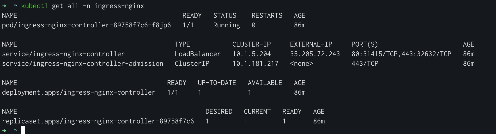
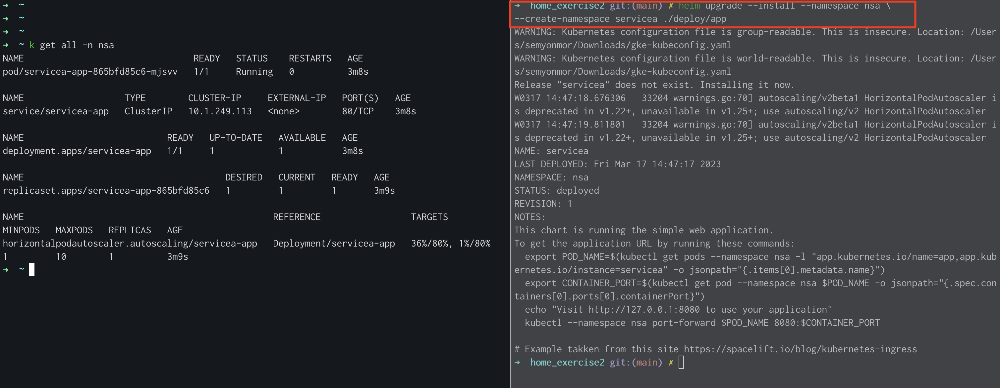
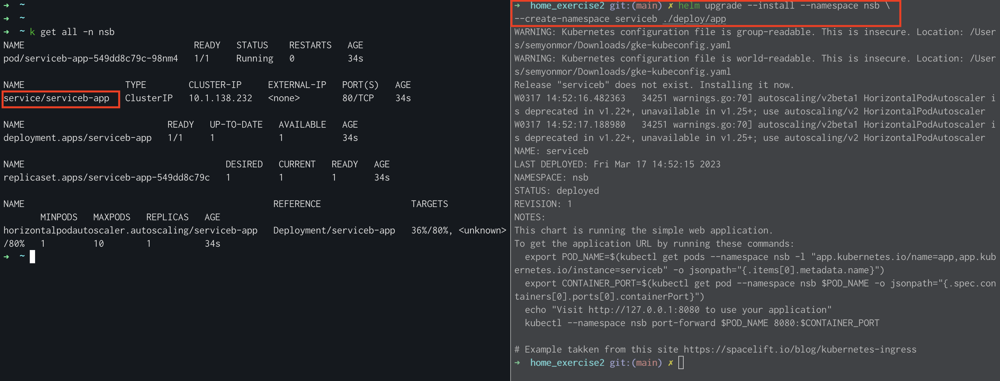
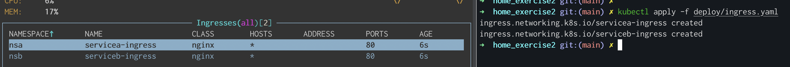

# Exercise Requirements

1. Use an existing k8s cluster.
   Deploy 2 deployments (+ a service for each) with some web server that serves static
   content.
   Use helm chart for defining all the k8s resources.
2. Install nginx ingress controller and configure the following ingress rules:
```
http://NGINX_CONTROLLER_URL/servicea > service 1
```
```
http://NGINX_CONTROLLER_URL/serviceb > service 2
```
3. Set inbound rule for the ingress controller to allow only a specific source IP (your own
   home IP)
4. Deploy HPA for one of the services based on CPU and use any tool you want to load nginx
   service that will trigger the autoscaling

# Final result:
- Push to public github repo the helm files
- IP/hostname to access the Nginx controller ( no need of HTTPS/SSL )

# Deployment

## Application deployment

- Install helm client [Helm Installation](https://helm.sh/docs/intro/install/)
- Install [kubectl](https://kubernetes.io/docs/tasks/tools/)

### Deploy NGINX Ingress Controller
```shell
helm upgrade --install ingress-nginx ingress-nginx --repo https://kubernetes.github.io/ingress-nginx --namespace ingress-nginx --create-namespace
```

### Deploy Service A
```shell
helm upgrade --install --namespace <NAMESPACE NAME SERVICEA> --create-namespace <RELEASE NAME SERVICEA> ./deploy/app
```

### Deploy Service B
```shell
helm upgrade --install --namespace <NAMESPACE NAME SERVICEB> --create-namespace <RELEASE NAME SERVICEA> ./deploy/app
```

### Deploy Ingress
```shell
kubectl apply -f deploy/ingress.yaml
```

### Configure Network Policy
```shell
kubectl apply -f apply -f networkpolicy.yaml
```
### Result


## Cleanup
```
#uninstall services for apps
helm delete <RELEASE NAME SERVICEA> -n <NAMESPACE NAME SERVICEA>
helm delete <RELEASE NAME SERVICEB> -n <NAMESPACE NAME SERVICEB>

#uninstall ingress controller
helm delete ingress-nginx -n ingress-nginx

#delete ingress rule
kubectl delete -f deploy/ingress.yaml

#delete network policy
kubectl delete -f apply -f networkpolicy.yaml
```

